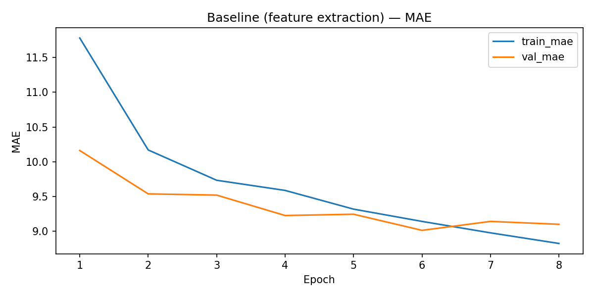
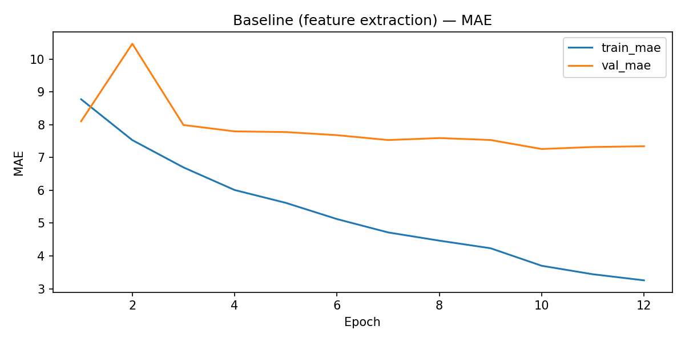

# Age Estimation with ResNet50 (Regression)

Predict human age from face images using TensorFlow/Keras and transfer learning (ResNet50).  
This project follows a reproducible, two-stage training pipeline (feature extraction → fine-tuning) and reports performance using **MAE (years)**.

---

## Dataset

- **Name:** `faces` (provided by the bootcamp)
- **Labels:** `file_name`, `real_age` (integer ages)
- **Samples:** 7,591 images (df shape: `(7591, 2)`)
- **Duplicates:** 0 duplicated filenames
- **Age stats:**
  - min=1, max=100, mean=31.20, std=17.15
  - 25%=20, 50%=29, 75%=41

> ⚠️ Images and trained model files are not uploaded to GitHub due to size constraints.

---

## Hypothesis

Transfer learning with a pretrained ResNet50 backbone will capture robust facial features and, after fine-tuning the last layers with a small learning rate, reduce test MAE compared to a frozen-backbone baseline.

---

## Project Goal

Train a regression model to predict age from face images, using:

- Professional data audit and reproducible splits
- `tf.data` input pipeline
- Two-stage training:
  1. Feature extraction (frozen backbone)
  2. Fine-tuning (unfreeze last N layers + freeze BatchNorm)
- Evaluation on a held-out test set
- Error analysis (by age bins + worst errors)
- Exported metrics/figures for reporting

---

## Approach

### Data Splits (Reproducible)

- Train/Val/Test = **70/15/15**
- Seed = **42**
- Stratification: **10 quantile bins** over `real_age` (`stratify_bins=10`)

### Data Location (Not Included)

This repository does **not** include the dataset images. To run training locally, place:

- Images: `data/images/`
- Labels CSV: `data/labels.csv` (path can be changed in `configs/default.yaml`)

---

## Input Pipeline (`tf.data`)

- Decode → resize → **ResNet50.preprocess_input**
- Batch size: **32**
- Prefetch enabled
- **No caching**
- **No augmentations** (kept minimal for a clean baseline)

> Note: Not using augmentation likely limited generalization. Future work includes adding light photometric/geometric augmentations.

---

## Model

### Backbone

- **ResNet50** pretrained on **ImageNet**

### Regression head

- Dense(128) + Dropout(0.2)
- Dense(1) output (age)

### Optimizer / LR

- Adam
  - Stage 1 LR = **1e-3**
  - Stage 2 LR = **5e-5**

---

## Training

### Stage 1 — Feature Extraction

- Backbone frozen
- Epochs: **8**
- Callbacks:
  - ModelCheckpoint (best `val_mae`)
  - EarlyStopping
  - ReduceLROnPlateau

### Stage 2 — Fine-tuning

- Unfreeze last **30 layers** (`fine_tune_n_last=30`)
- **BatchNorm frozen** to stabilize fine-tuning with smaller batches
- Epochs: **12**
- Callbacks:
  - ModelCheckpoint (best `val_mae`)
  - EarlyStopping
  - ReduceLROnPlateau

---

## Results (MAE ↓)

|                                   Stage | Test MAE (years) |
| --------------------------------------: | ---------------: |
|           Baseline (feature extraction) |        **9.047** |
| Fine-tuning (last 30 layers, BN frozen) |        **7.065** |

**Improvement:** ~**1.98 years** MAE (≈ **22%** relative improvement).

### Learning Curves

Baseline:


Fine-tuning:


---

## Error Analysis (Highlights)

- MAE increases significantly for older ages (e.g., 70–100), likely due to **class imbalance** (fewer samples) and higher visual variability.
- Worst errors often occur on:
  - low-quality / blurry images
  - occlusions
  - atypical aging cues (young-looking older adults or vice versa)

---

## Repository Structure

```text
.
├── configs/
│   └── default.yaml
├── notebooks/
│   ├── 01_data_audit_eda.ipynb
│   ├── 02_baseline_train.ipynb
│   └── 03_finetune_eval.ipynb
├── reports/
│   ├── figures/
│   │   ├── baseline_mae_curve.png
│   │   └── finetune_mae_curve.png
│   └── metrics/
│       ├── baseline_test_metrics.json
│       ├── finetune_test_metrics.json
│       ├── split_summary.json
├── src/
│   ├── __init__.py
│   ├── config.py
│   ├── data.py
│   ├── model.py
│   ├── train.py
│   ├── eval.py
│   └── utils.py
├── .gitignore
├── LICENSE
├── pyproject.toml
├── requirements.txt
├── requirements-dev.txt
└── README.md
```

> Notes:
>
> - `data/` (images + labels) and `models/` are intentionally **not** tracked in Git.

---

## Installation

### 1) Create and activate a virtual environment (WSL/Linux/macOS)

```bash
python3 -m venv .venv
source .venv/bin/activate
python -m pip install --upgrade pip
```

### 2) Install dependencies (includes notebook tooling)

```bash
pip install -r requirements-dev.txt
```

### 3) Install the project in editable mode (enables `from src...` imports)

```bash
pip install -e .
```

---

## GPU note (WSL2)

This project was developed and executed on **WSL2 + VS Code** to enable **TensorFlow GPU acceleration** with an NVIDIA GPU.
If you want GPU support, make sure you are running inside WSL2 with the proper NVIDIA drivers + CUDA/cuDNN available in WSL, and verify TensorFlow detects the GPU:

```bash
python -c "import tensorflow as tf; print(tf.__version__); print(tf.config.list_physical_devices('GPU'))"
```

If the output list is empty (`[]`), TensorFlow is running on CPU.

---

---

Artifacts:

- Metrics (tracked): `reports/metrics/`
- Figures (tracked selectively): `reports/figures/`

---

License

MIT License. See `LICENSE` file for details.
